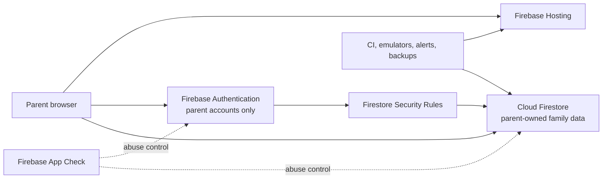

# BRKAR backend and infrastructure plan

**Status:** static Hosting is live on the Spark plan. Authentication providers are enabled in the Firebase Console, but the app has no Firebase client integration or authenticated flow. Firestore has not been created, and Storage currently requires a plan upgrade.
**Product boundary:** a supervised learning pilot for children and families, with Arabic-first UI and Arabic, English and French curriculum content.

## Current state

- Firebase Hosting serves the static Vite application from `dist` and applies a restrictive content security policy and browser security headers.
- Profiles, mission drafts and learning evidence are kept in the current browser's local storage. The application has no Firebase SDK, authenticated flow, Firestore, Storage, server API, analytics or child account.
- The parent dashboard currently shares the browser profile with the child area; it is not protected by an account. This is suitable only for the moderated, single-device pilot described in the release checklist.
- GitHub Actions tests and builds the site, then deploys Hosting from `main` to the existing `barmoj-266b8` project using a repository service-account secret. The workflow does not deploy Firestore or Storage rules.
- Firebase Console snapshot (2026-10-04): Email/Password and Google sign-in are enabled. Sign-up and account deletion are allowed, and email-enumeration protection is enabled. These settings do not create a sign-in experience in this app because no Firebase Auth SDK is wired into the client.
- The project has two active Firebase Web App registrations with the same display name. The deployed app's intended registration has not been mapped. Do not copy either registration's configuration into the client until the target is confirmed.
- The Auth authorized-domain list currently contains `localhost`, `barmoj-266b8.firebaseapp.com` and `barmoj-266b8.web.app`. A custom BRKAR domain is not listed. The Firestore Console shows the initial “Create database” state, so there is no database or selected location yet. The Storage Console says the project must upgrade from Spark to use Storage. The repository's default-deny rules are not deployed by the current workflow.

## Recommended shape

Keep the frontend static and use Firebase's managed products for the first remote family pilot. Add a server only for operations that need trusted credentials or privileged behavior.



The first remote version should not introduce child logins, public profiles, uploads, chat, behavioral analytics, payments or open-ended AI. Those create separate identity, moderation, privacy and abuse surfaces.

## Identity and access

1. Create accounts for parents or guardians only. Keep children as pseudonymous profiles owned by a parent; do not ask children for email, phone number or password.
2. The project currently has Email/Password and Google enabled. Before connecting the app, decide whether to keep one parent sign-in option or support both. Passwordless email link is a reasonable pilot choice if families can reliably receive email. Keep phone sign-in as a later option only if family research supports it. Do not reveal whether an email is registered, and do not place the email in a sign-in URL.
3. Use session-only persistence by default on shared family devices. Offer “remember this device” only as an adult-controlled choice, and make sign-out and switching families easy to find.
4. Treat client-side route guards as navigation only. Firestore Rules must authorize every read and write using the authenticated parent's UID. Never trust a client-supplied `parentUid`, role, consent state or billing state.
5. App Check should complement Authentication and Rules. Register the real Hosting domains, integrate the web provider, inspect request metrics, then enforce before the authenticated backend opens to families.

## Data boundary

Use one parent-owned tree so the default authorization boundary is easy to audit:

```text
parents/{parentUid}
  children/{childId}
    evidence/{evidenceId}
```

The child profile should contain only an optional nickname, a broad age band if needed, preferred language and child-chosen learning preferences. Keep the parent's email in Firebase Authentication instead of copying it into Firestore. Store only the minimum progress and learning evidence the family needs. Do not collect exact birth dates, school, precise location, contacts, health details, photos, voice recordings, religious belief, or advertising identifiers.

Free-text predictions and explanations can include identifying details even when the form does not ask for them. Before cloud sync, decide whether to store a short parent-visible excerpt, a structured summary, or no text at all; set length limits and a clear retention period. Do not silently upload the existing local-storage records. If migration is later added, make it an explicit parent action with a preview and a way to cancel.

Client Rules should start closed, then be opened only for a reviewed schema. Validate field allowlists, types, enum values, maximum lengths and immutable creation/owner fields in Rules. Test owner access, cross-family denial, signed-out denial, malformed writes, updates and deletes in the Emulator Suite. Server/Admin SDKs bypass Firestore Rules, so any future function must repeat authentication, ownership, validation and rate-limit checks.

Deletion needs a designed path before remote accounts launch: Firestore does not recursively delete subcollections when a parent document is removed. A trusted deletion operation must remove the parent's children and evidence, then remove the Authentication account, with a clear completion state and a tested recovery/retention policy. Provide an adult export and deletion request path that does not expose other families' records.

## Environments and location

Use distinct Firebase projects for development, staging and production. Keep the current `barmoj-266b8` project as the live Hosting project until ownership, access and migration are confirmed. Keep emulator tests on a `demo-*` project ID, which cannot accidentally write to real Firebase services. Staging must never point at production Auth or Firestore.

Before creating a production Firestore database, choose its location. Firestore's database location cannot be changed after provisioning. Select it only after reviewing target-market data-residency requirements, latency, service co-location and cost with qualified local privacy counsel. Do not treat a nearby European region as proof of compliance in Morocco or other MENA markets.

Cloud Storage is not needed for the current product; its repository rules therefore deny all access, and the current Spark plan does not permit using Storage without an upgrade. If a future feature needs files, prefer reviewed parent/educator resources hosted with the app. Do not accept child photos or recordings by default.

## Backend services by stage

### Current moderated pilot

- Keep local-only profile and evidence behavior.
- Keep sign-up out of the app until the adult account flow, guardian notice, support contact, privacy notice, retention and deletion behavior are ready. Auth providers are already enabled in the Console, so review whether unused sign-up should remain available before sharing the Firebase client configuration publicly.
- Keep Firestore and Storage closed by default; run rules tests in CI.

### Remote family pilot

- Add the parent-only Auth flow and parent-owned Firestore data model after market-specific consent and privacy review.
- Use App Check, strict Rules, emulator tests, a dev/staging/prod project split, export/deletion controls, backup and restore checks, and quota/budget alerts before inviting families.
- Keep Firestore browser persistence in memory for the shared-device pilot unless offline use is a proven need and cached child data has a reviewed clearing policy.

### Later trusted workflows

- Add Cloud Functions v2 only for server-trusted tasks such as recursive account deletion, billing webhooks or a bounded AI proxy. Keep functions small, idempotent, region-aligned with Firestore, and capped for normal pilot traffic. Put secrets in Secret Manager; never ship Admin SDK credentials or model keys to the browser.
- For future payments, keep checkout and billing controls in the parent area, use a payment provider's hosted checkout, validate signed webhooks on the server, and do not store card data.
- For future AI, require adult opt-in, use bounded hint/check roles, minimize the data sent, and do not infer a child's personality, faith, diagnosis or ability from activity.

## Delivery and operations

- Keep the lockfile and `npm ci`; run app tests, production build and Firestore Rules tests before deployment.
- Use Hosting preview channels for review. Deploy database Rules separately from Hosting so a frontend release cannot silently widen database access.
- Scope `GITHUB_TOKEN` permissions per job. Replace the long-lived Firebase service-account JSON secret with GitHub OIDC / Workload Identity Federation and a deploy-only service account after its exact repository, branch and permissions are configured. Rotate/remove the old key only after a federated deploy succeeds.
- Pin third-party GitHub Actions to verified full commit SHAs and use Dependabot to maintain actions and npm dependencies.
- Keep child-answer text and identity out of error logs. Start without product analytics; use operational error and quota signals only. Add billing budgets/alerts, Firestore usage monitoring, backup export, and a restore drill before remote family data is stored.
- Review IAM regularly: use named people, a second trusted project owner, least privilege, MFA on Google/GitHub accounts, and no shared credentials. Protect the production project against accidental deletion.

## Gates before live provisioning

1. Inventory Authentication users and provider settings, Firestore, Storage, IAM, billing plan, registered apps, authorized domains and database locations. Confirm which of the two Web App registrations belongs to the deployed site.
2. Confirm the legal operator, family support contact, guardian/consent flow, data retention and deletion plan with qualified counsel for Morocco and intended MENA markets.
3. Confirm the parent sign-in experience and approve a Firestore location before connecting the app or creating a database. The location cannot be changed after database creation.
4. Build and test the authenticated parent flow and owner-only Rules in a separate development project and emulator first.
5. Only after those checks, connect the app to production Auth/App Check/Firestore, deploy reviewed Rules, and invite a small opt-in group.

## References

- [Firebase security checklist](https://firebase.google.com/support/guides/security-checklist)
- [Firebase project and environment best practices](https://firebase.google.com/docs/projects/dev-workflows/general-best-practices)
- [Firestore location selection](https://firebase.google.com/docs/firestore/locations)
- [Firebase email-link authentication](https://firebase.google.com/docs/auth/web/email-link-auth)
- [Firebase Auth session persistence](https://firebase.google.com/docs/auth/web/auth-state-persistence)
- [Testing Firestore Rules with the Emulator](https://firebase.google.com/docs/firestore/security/test-rules-emulator)
- [App Check request metrics and enforcement](https://firebase.google.com/docs/app-check/monitor-metrics)
- [Firebase launch checklist](https://firebase.google.com/support/guides/launch-checklist)
- [GitHub Actions secure-use guidance](https://docs.github.com/en/actions/reference/security/secure-use)
